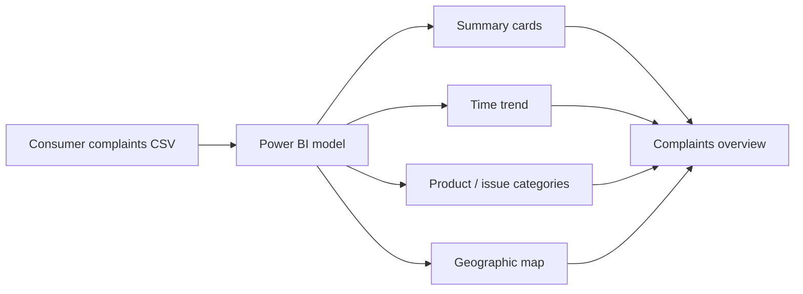

# 📣 Financial Consumer Complaints

> **Question:** What patterns can be seen in the supplied consumer-complaint records across time, geography, products, and complaint topics?

This Power BI project packages a report and a separate CSV of consumer complaint records. The report is designed to make complaint volume and mix easier to explore through summary cards, trend and category charts, a map, and interactive filters.

## Dashboard at a glance

The report contains a single overview page with cards, a bar chart, map, area chart, treemap, donut chart, and slicers. Use the filters to compare the available complaint dimensions and then verify each visual against its included source data.

## Files

| File | Role |
| --- | --- |
| [`Financial Complaints Overview.pbix`](<./Financial Complaints Overview.pbix>) | Power BI dashboard/report. Open with Power BI Desktop. |
| [`Financial Consumer Complaints.csv`](<./Financial Consumer Complaints.csv>) | Source data supplied alongside the report. |

## Open and refresh

Download both files. Open the PBIX in Power BI Desktop to view the report. The separate CSV is included for transparency and possible refresh; source paths, credentials, and refresh requirements can vary by machine. If Power BI asks for a source location, point it to the downloaded CSV and verify data types before refreshing.

## Interpretation notes

- Complaint counts describe records in the supplied file, not the prevalence of a problem among all consumers.
- Complaint volume can be affected by reporting, company size, product mix, and data coverage.
- The repository does not document the data snapshot date or field definitions; confirm these before citing a trend or comparing categories.
