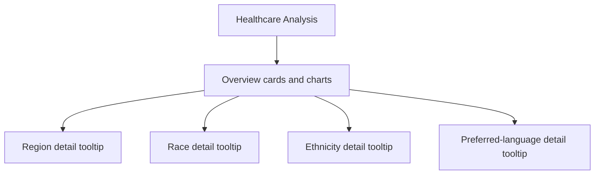

# Healthcare Analysis Report

> Workflow illustration only; it is not a dashboard screenshot or a source of measured results.

> **Question:** How does the population represented in the report vary across healthcare-related demographic categories?

This Power BI report presents a healthcare overview with a primary analysis page and tooltip pages for region, race, ethnicity, and preferred language. The accompanying Excel workbook supplies the report's project data.

## Report navigation

The report includes KPI cards, a donut chart, a clustered bar chart, demographic slicers, and custom tooltip pages. Hover over applicable visual elements in Power BI Desktop to reveal the demographic detail pages.

## Files

| File | Role |
| --- | --- |
| [`Healthcare Report.pbix`](<./Healthcare Report.pbix>) | Power BI report with the overview and demographic tooltip pages. |
| [`Data for healthcare analyst.xlsx`](<./Data for healthcare analyst.xlsx>) | Supporting data workbook. Review its sheets and field definitions to understand exactly what the reported measures represent. |

## Open and refresh

Open the PBIX in Power BI Desktop. The separate workbook is included as the supporting source file; refresh may require repointing the model to the downloaded workbook and confirming credentials and table/sheet selection.

## Interpretation and privacy

- This is a demographic breakdown of the workbook's supplied population, not a clinical outcome, quality-of-care, or health-equity finding unless the data definitions support that interpretation.
- The repository does not document population coverage, collection period, or measure definitions. Check the workbook and report filters before interpreting totals or percentages.
- Avoid inferring individual health characteristics from aggregate demographic categories.
