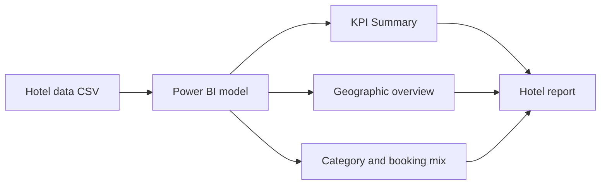

# 🏨 Hotel Performance Report

> **Question:** What operational and commercial patterns can be explored in the hotel records included with this report?

The Power BI project includes a KPI summary page and an overview page with geographic and category-based visuals. A separate hotel CSV is supplied for the model/data workflow.

## Dashboard map

The report has two main pages:

- **KPI Summary Dashboard** — headline cards, a time-oriented area chart, a category chart, and slicers.
- **Overview Dashboard** — geographic map and additional category breakdowns, including bar, treemap, and donut-style visuals.

## Files

| File | Role |
| --- | --- |
| [`Hotel Report.pbix`](<./Hotel Report.pbix>) | Power BI report with the KPI and overview pages. |
| [`hotel data.csv`](<./hotel data.csv>) | Supporting hotel dataset used to interpret or refresh the report. |

## Open and refresh

Open the PBIX in Power BI Desktop. The source CSV is included separately; refreshing on another computer may require locating that file and confirming the model's data types and field mappings.

## Interpretation notes

- The project directory does not document all KPI definitions, date coverage, or the grain of a row. Check the CSV and model before describing a measure as bookings, stays, rooms, or revenue.
- The report is a descriptive view of the supplied data, not a forecast or causal assessment of hotel performance.
- Confirm whether monetary values have a documented currency before publishing or comparing them.
