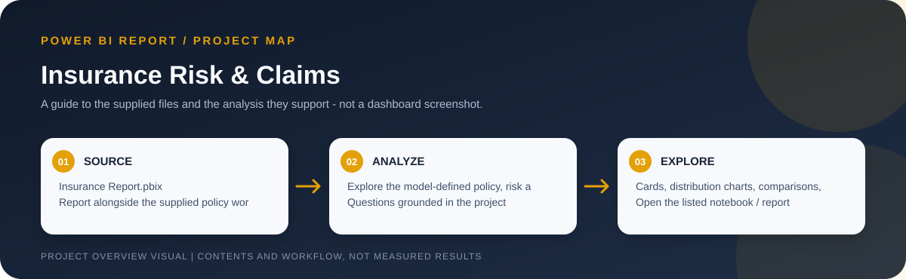
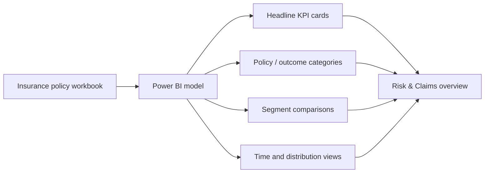

# Insurance Risk & Claims Analysis

> Workflow illustration only; it is not a dashboard screenshot or a source of measured results.

> **Question:** What patterns in the supplied insurance-policy and claims fields can be explored across customer, policy, and outcome categories?

This Power BI report organizes insurance risk and claims information into an interactive overview. The companion Excel file provides the supporting insurance-policy data.

## Report structure

The report contains cards, donut and pie charts, clustered comparisons, a column chart, a ribbon chart, an area chart, a table/matrix, and slicers. Use those report controls to explore the available categories and then check the measure definitions in the model.

## Files

| File | Role |
| --- | --- |
| [`Insurance Report.pbix`](<./Insurance Report.pbix>) | Power BI report titled "INSURANCE RISK & CLAIMS ANALYSIS." |
| [`insurance_policies_data.xlsx`](<./insurance_policies_data.xlsx>) | Supporting insurance-policy data workbook. |

## Open and refresh

Open the PBIX with Power BI Desktop. To refresh from the accompanying Excel file, locate the downloaded workbook when prompted and verify sheet/table selection, data types, and refresh credentials.

## Responsible interpretation

- "Risk" and "claims" are broad dashboard labels; verify the model's actual measures and policy/claim field definitions before interpreting a visual as claim frequency, severity, loss ratio, or actuarial risk.
- The workbook's source, time period, coverage, and definitions are not fully described in the project folder.
- Dashboard associations are descriptive and do not establish causal drivers or insurance pricing recommendations.
