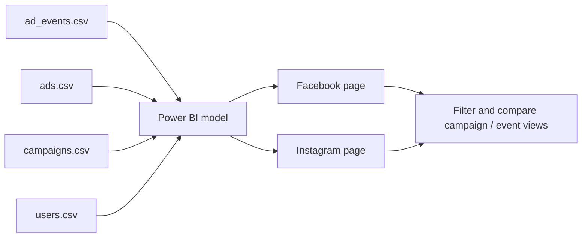

# 📱 Meta Ads Performance

> **Question:** How do the advertising measures represented in the supplied events, ads, campaigns, and users data compare across the Facebook and Instagram report pages?

This Power BI report contains separate **Facebook** and **Instagram** pages. Each page uses KPI cards, charts, maps, tables, and slicers to make the platform-specific advertising data explorable.

## Data-to-report flow

## Files

| File | What it contributes |
| --- | --- |
| [`Ads Report.pbix`](<./Ads Report.pbix>) | Power BI report with Facebook and Instagram analysis pages. |
| [`ad_events.csv`](<./ad_events.csv>) | Event-level advertising activity data. |
| [`ads.csv`](<./ads.csv>) | Ad-level lookup/details. |
| [`campaigns.csv`](<./campaigns.csv>) | Campaign-level attributes. |
| [`users.csv`](<./users.csv>) | User-level attributes used by the model. |

## Explore the report

Open the PBIX in Power BI Desktop and navigate between Facebook and Instagram. Each page includes summary cards, a mix of donut and column charts, geographic and table views, and slicers. Use the slicers to compare the available platform and campaign dimensions.

## Refresh and metric definitions

The four CSVs are provided separately for source transparency and refresh. On another computer, Power BI may require you to repoint the model to the downloaded CSV files and confirm table relationships.

The repository does not define every advertising KPI or its denominator. Verify the model's measures before describing values as reach, impressions, clicks, conversions, spend, or return on ad spend. The page names and source filenames alone do not establish those metric definitions.
