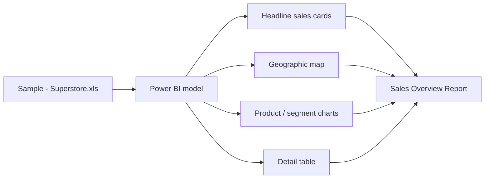

# 📊 Sales Overview Report

> **Question:** What sales patterns can be explored across product, customer, and geographic dimensions in the supplied Superstore sample?

This Power BI project pairs a one-page sales report with the sample workbook used alongside it. The report presents summary cards, slicers, geographic views, category comparisons, and a table for drilling into the available records.

## Analysis flow

## Files

| File | Role |
| --- | --- |
| [`Sales Overview Report.pbix`](<./Sales Overview Report.pbix>) | One-page Power BI report with sales visuals, slicers, map, and table. |
| [`Sample - Superstore.xls`](<./Sample - Superstore.xls>) | Supporting sample workbook in the project folder. |

## Open and refresh

Open the PBIX in Power BI Desktop. The Excel workbook is provided alongside it; if refresh is needed, point the model to the downloaded file and check sheet/table selection and field types.

## Interpretation notes

- Confirm the report's sales, profit, order, and discount measure definitions in the model before quoting them.
- The project folder does not specify the sample's date range or currency convention.
- The report is descriptive; map or category differences do not by themselves explain why sales differ.
