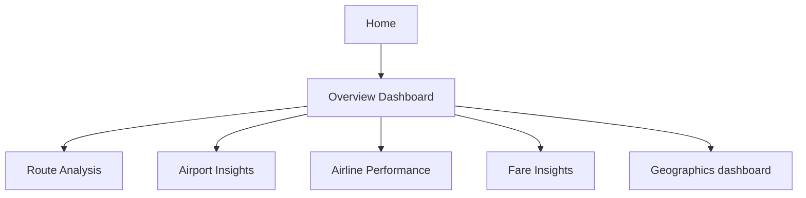

# ✈️ US Airline Routes, Fares & Performance

> **Question:** How can the supplied US airline route and fare data be explored across airlines, airports, routes, geography, and price?

This Power BI report organizes airline information into six analytical pages plus a home/navigation page. The dashboard is designed to help readers move from a broad overview to route, airport, airline, fare, and geographic perspectives.

## Page guide

- **Overview Dashboard** — headline cards and high-level trend/distribution visuals.
- **Route Analysis** — route-level comparisons, scatter and map views, and a detail table.
- **Airport Insights** — airport comparisons with bar, line, and ribbon-style visuals.
- **Airline Performance** — airline comparison cards, charts, and a table.
- **Fare Insights** — fare comparisons using trend, distribution, and category charts.
- **Geographics dashboard** — map and treemap views for geographic patterns.
- **Home** — report navigation and introductory visuals.

## Files

| File | What it contributes |
| --- | --- |
| [`Airlines Analysis.pbix`](<./Airlines Analysis.pbix>) | Multi-page Power BI report with route, airport, airline, fare, and map analysis. |
| [`US Airline Flight Routes and Fares.csv`](<./US Airline Flight Routes and Fares.csv>) | Supporting flight-route/fare dataset for the report. |
| [`Terminology Doc.docx`](<./Terminology Doc.docx>) | Companion terminology reference for reading the project. |

## Open and refresh

Open the PBIX in Power BI Desktop. Use the page tabs to navigate between levels of analysis and slicers to explore the report's available dimensions. The CSV and terminology document are provided separately; refreshing on another computer may require repointing the data source.

## Interpretation notes

- The CSV's coverage period, fare units, and exact observational grain should be confirmed before interpreting totals or averages.
- Route counts or fares in the supplied file do not necessarily represent every flight or current market prices.
- Airline and geography comparisons are descriptive, not causal or service-quality rankings unless the underlying metric definitions support that conclusion.
